# Peekaboo AR — a character hiding behind objects

Scan the room once. The app secretly picks one of the objects it saw; that object glows from behind, brighter as you get closer. Hold it in view for five seconds and a character sneaks out from **behind** it. Tap it to collect it. The collection is a 15-species dex modelled on Chiikawa (먼작귀): which species appears depends on the object it hides behind, with rarity tiers, a night-only secret and set completion. Official artwork slots are empty until a license is in place; until then each species renders as a name-tagged silhouette ([ADR-0018](docs/adr/0018-chiikawa-dex-and-skin-slot.md)).
No build step: just `index.html` + `app.js`. Libraries come from a CDN as ES modules and the models load straight from Google's storage.

- Detection: MediaPipe ObjectDetector (EfficientDet-Lite0 fp16, COCO 80 classes)
- Occlusion: MediaPipe InteractiveSegmenter (MagicTouch) mask clips the video and is drawn over the character
- Tracking: lock the largest detection of the chosen class → IoU matching → One Euro filter smoothing
- Targetable classes: all 80 COCO classes except people, animals, vehicles, street fixtures, dining table and bed ([ADR-0014](docs/adr/0014-targetable-all-but-excluded.md))

## Run it

1. **GitHub Pages**: every push to `main` deploys via `.github/workflows/pages.yml` → open `https://jihoo-o.github.io/peekaboo/` in Android Chrome.
   Pages is not available for private repos on the free plan. Make the repo public first (Settings → General → Danger Zone → Change visibility), then trigger `pages` from the Actions tab.
2. **Local**: `npx serve .` and expose it over HTTPS (for example `cloudflared tunnel --url http://localhost:3000`). Camera permission is only granted on HTTPS or localhost.
3. Tap **카메라 시작** (start camera) and slowly look around for 5 s (scan ring in the center, countdown in the hint). The app records every recognized object together with the camera direction it was seen from (gyro), keeps the ones it saw at least 3 times, picks one weighted by how often it was seen, and stores it in `localStorage`. The hint lists the candidates; after 20 s without finding it, the hint names the object. While the target is out of frame, the screen edge facing it glows orange with an arrow (from the gyro difference, or from the side it left the frame when there is no gyro). Find the object that glows from behind (a warm radial glow plus an orange rim ring that stays visible on bright backgrounds); the glow strengthens as you get closer (bbox width). Hold it in view for 5 s (soot particles rise, a progress ring fills, the glow pulses faster) and the sprite sneaks out from behind the object: it waddles out a little, flinches back, then settles half hidden (2.4 s). Move the phone sideways or look from above (so the object drifts off the center of the frame) and the sprite is revealed further, as if you were peeking around the object. From then on the object counts as solved and the sprite pops out as soon as it is recognized. Large objects or objects at the top of the frame get the sprite at their side instead of above.
4. Tap the character: an uncollected one (shows a yellow "!") is added to your dex; an already collected one just wiggles. The ★ badge at the top right opens the dex (three sets: 주역·친구·갑옷, rarity dot per slot, silhouettes for unknown species), which also has a reset button. The shutter button at the bottom shares or saves the composited image with a name + rarity stamp.

### URL query parameters

| Query | Effect |
|---|---|
| `?res=480` | Lower the camera input to 640×480 (use when detection is below 10 Hz) |
| `?mask=0` | Disable segmentation and use the S3 rectangular bbox occlusion only |
| `?debug=1` | Show detection boxes and labels (hidden by default since S16; the HUD is always on) |
| `?reset=1` | Forget the chosen object, clear the collection and rescan |
| `?skin=silhouette` | Ignore official skin files and draw the name-tagged silhouettes |
| `?skin=drawn` | Use the S17 canvas drawings instead of the S20 pixel sprites |

HUD (top-left): detection Hz · segmentation Hz · render fps · delegate · locked class · miss time · character state · mask state.

## Stages (see the `S1`–`S5` comments in the code and the commit history)

| Stage | What | Commit |
|---|---|---|
| S1 | Camera + ObjectDetector loop + HUD | `S1: camera + object detection` |
| S2 | Target lock + IoU matching + One Euro filter | `S2: target lock + one euro filter` |
| S3 | 2D character peek/idle/hide + rectangular bbox occlusion | `S3: character peek with bbox occlusion` |
| S4 | InteractiveSegmenter mask occlusion (EMA, blur, IoU gate) | `S4: segmentation mask occlusion` |
| S5 | Tap → wave, shutter → Web Share / download, hint text | `S5: tap reaction + share` |
| S6 | (optional) three.js GLB character, iOS check — **not done**, see [ADR-0007](docs/adr/0007-skip-s6-glb-and-ios.md) | — |
| S7 | Game: remember one object, 5 s hold before appearing, soot-sprite character, tap to collect, collection panel ([ADR-0011](docs/adr/0011-home-object-by-class-label.md), [ADR-0012](docs/adr/0012-collection-by-candy-color.md)) | `S7: collection game` |
| S8 | Room scan → random hidden target, glow behind the object scaled by closeness, "짠!" pop entrance ([ADR-0013](docs/adr/0013-scan-then-random-target-and-glow.md)) | `S8: scan, glow, pop` |
| S9 | All COCO classes targetable except an exclude list ([ADR-0014](docs/adr/0014-targetable-all-but-excluded.md)) | `S9: all COCO classes targetable except an exclude list` |
| S10 | Side entrance when there is no room above the object; once solved, the sprite appears immediately on re-lock ([ADR-0015](docs/adr/0015-side-placement-and-solved-skip.md)) | `S10: side placement + instant appearance once solved` |
| S11 | Sneak-out entrance from a fully hidden position with a waddle and a flinch, replacing the pop ([ADR-0016](docs/adr/0016-sneak-out-instead-of-pop.md)) | `S11: sneak out from behind the object` |
| S12 | Half-hidden rest pose + parallax reveal driven by the object's offset in the frame ([ADR-0017](docs/adr/0017-parallax-from-frame-offset.md)) | `S12: parallax reveal` |
| S13 | Chiikawa dex: 15 species, species chosen by the object's label with rarity weights, night-only secret, sets, official-asset skin slot with silhouette fallback, name stamp on shared photos ([ADR-0018](docs/adr/0018-chiikawa-dex-and-skin-slot.md)) | `S13: chiikawa dex` |
| S14 | Findability: scan candidates seen ≥ N times, weighted pick, candidate/label hints, visible glow ring ([ADR-0019](docs/adr/0019-findability-hints-and-glow-ring.md)) | `S14: findability` |
| S15 | 5-second scan, gyro target direction memory, edge glow hints when the target is out of frame ([ADR-0020](docs/adr/0020-five-second-scan-and-edge-direction-hint.md)) | `S15: edge direction hints` |
| S16 | Focus after appearance: glow fades to 15%, spotlight vignette around the sprite, opaque sprite, debug boxes opt-in, hint moved above the shutter ([ADR-0021](docs/adr/0021-focus-on-character-after-appearance.md)) | `S16: focus on the character` |
| S17 | Roster corrected to 14 actual characters and each drawn recognizably on canvas (`drawSpecies`); silhouettes via `?skin=silhouette` ([ADR-0022](docs/adr/0022-drawn-chiikawa-roster.md)) | `S17: drawn chiikawa roster` |
| S18 | Original (official) assets first: manifest entries with `file`/`scale`/`dy`/`wave`, wave-pose swap, pipeline verified with dummy PNGs; drawings only as fallback ([ADR-0023](docs/adr/0023-original-assets-only.md)) | `S18: original assets first` |
| S19 | Load original artwork on the device itself (dex panel → file picker → IndexedDB); nothing is uploaded or committed ([ADR-0024](docs/adr/0024-on-device-original-assets.md)) | `S19: on-device original assets` |
| S20 | Default character art = 22×24 pixel sprites in the Tamagotchi idiom (1px outline, flat tones, bean eyes, stub limbs, head accessories), generated from parts in `pixel.js`; original designs, no copied dots. Priority: device/manifest originals > pixel > `?skin=drawn` > `?skin=silhouette` ([ADR-0025](docs/adr/0025-pixel-sprites-default.md)) | `S20: pixel sprites` |

## Verification (headless Chromium + fake camera)

Without a phone at hand, the page was actually run under Playwright ([ADR-0004](docs/adr/0004-verify-with-fake-camera.md)). The fake camera feed is scikit-image's sample `coffee.png`, a real photo of a coffee cup.

| S1 detection | S4 mask occlusion | S8 scan | S12 half-hidden + parallax | S11 mid-sneak (side) | S10 side placement | S7 collected | S13 placeholder + tap | S13 dex | S20 pixel sheet | S20 in-game | S20 dex |
|---|---|---|---|---|---|---|---|---|---|---|---|
|  |  |  | 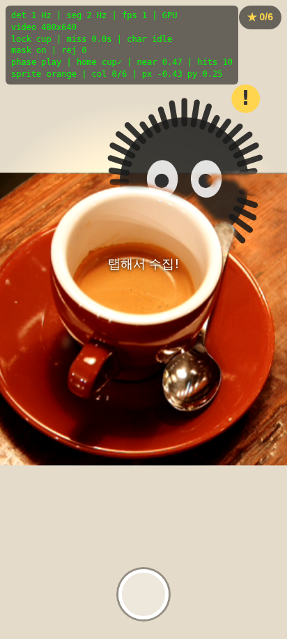 | 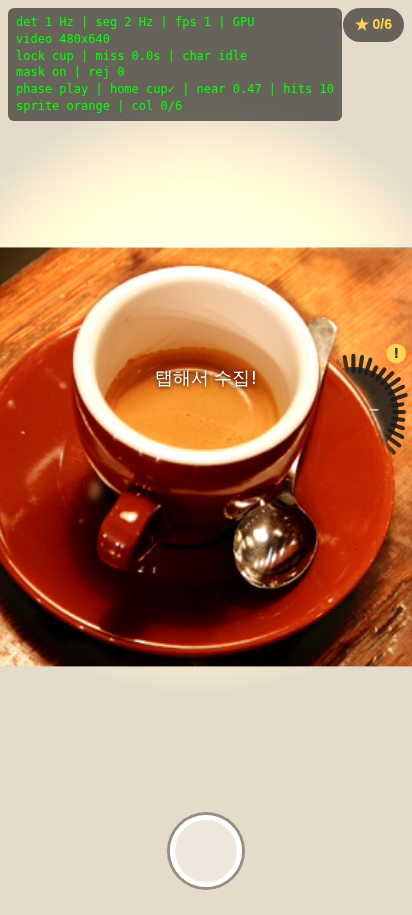 | 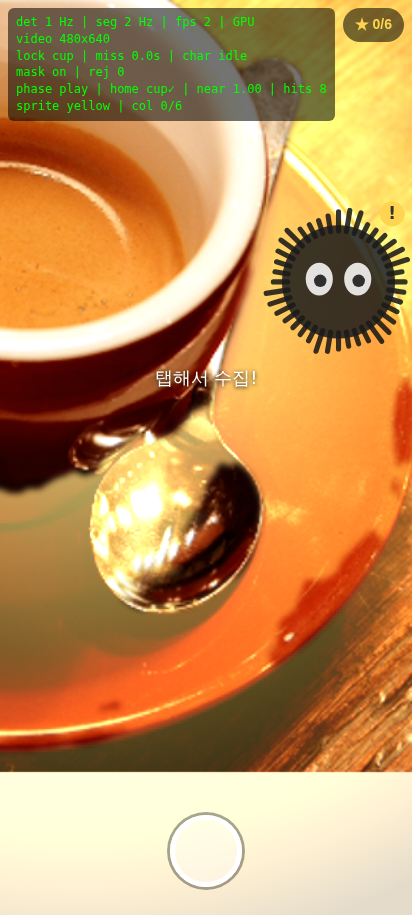 | 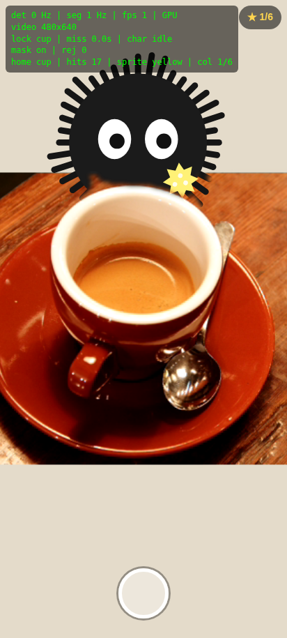 | 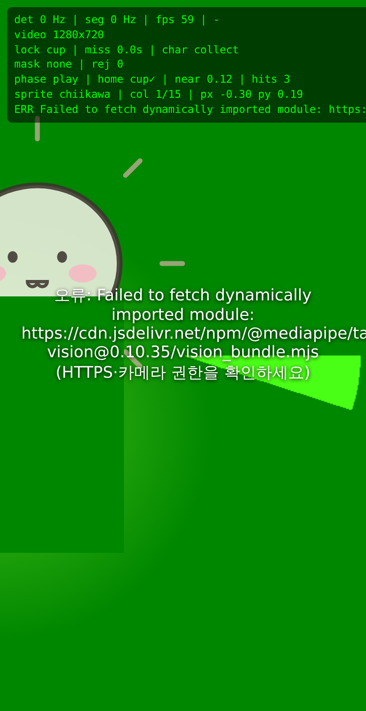 | 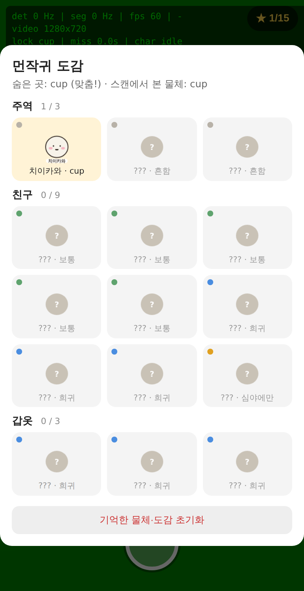 | 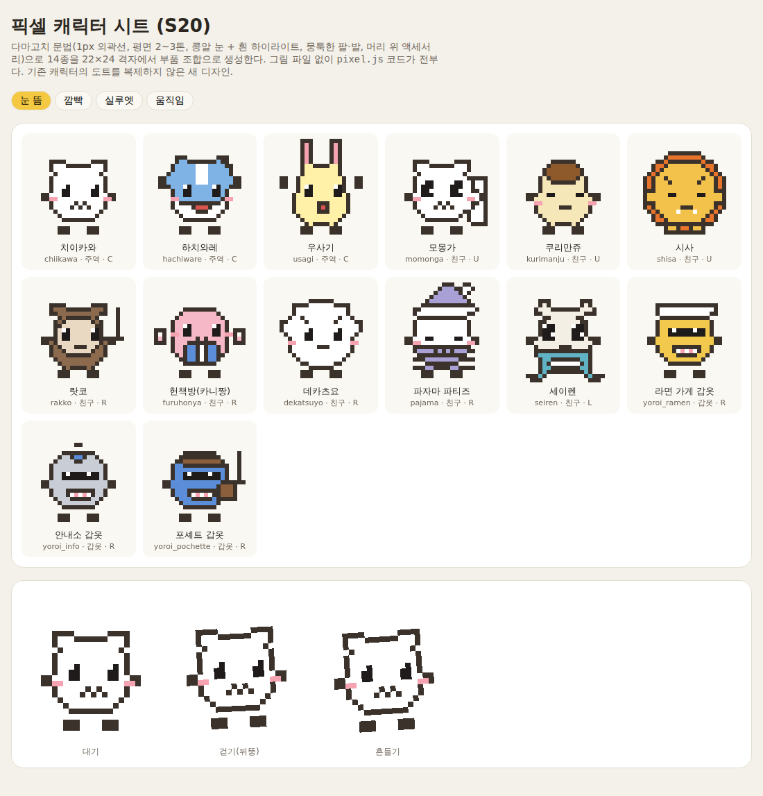 | 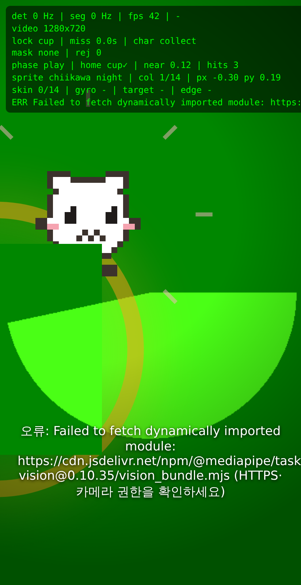 | 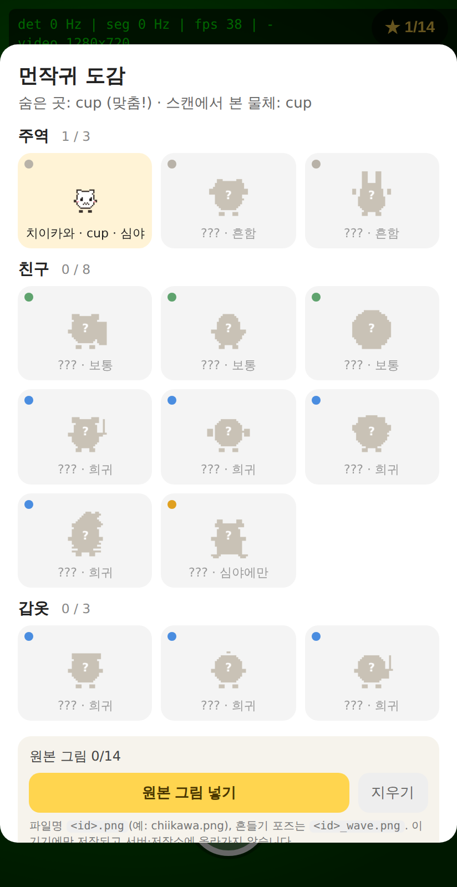 |

- Confirmed: scan → `cup` chosen and stored, `cup` detected at 0.69 and locked, glow drawn behind it, charging → pop → idle, the mask hides the sprite along the cup's curved rim, first tap → `collect` (collection 1/6 persisted in localStorage), second tap → `wave`, shutter → `peekaboo-<ts>.jpg` download.
- S13 (headless, Chromium fake camera, models blocked in the container so the lock was injected): `cup` lock → sneak → idle with species `chiikawa`; 400 draws of the species picker for `cup` gave chiikawa 257 · kurimanju 104 · yoroi_ramen 39, matching the 10:5:2 rarity weights; tap → `collect`, badge ★ 1/15, `peekaboo.collection` persisted with `night:false`; shutter → JPEG with the `치이카와 · 흔함 #Peekaboo` stamp; dex panel shows 주역 1/3 · 친구 0/9 · 갑옷 0/3 with rarity dots and silhouettes.
- Original-asset path with a dummy test PNG loaded on the device (S19; the real files are the rights holder's): 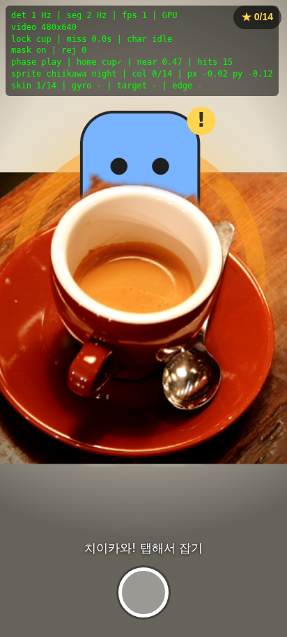
- All 14 species as drawn by `drawSpecies` (S17): 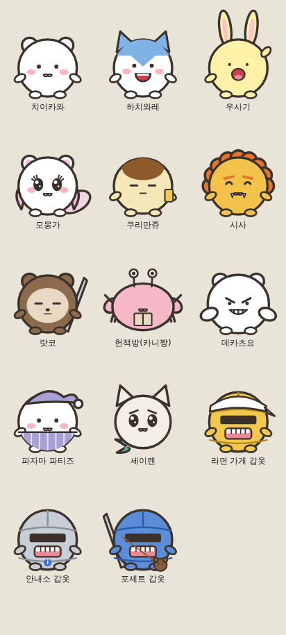
- Spotlight after the sprite appears (glow faded, background darkened, sprite opaque): 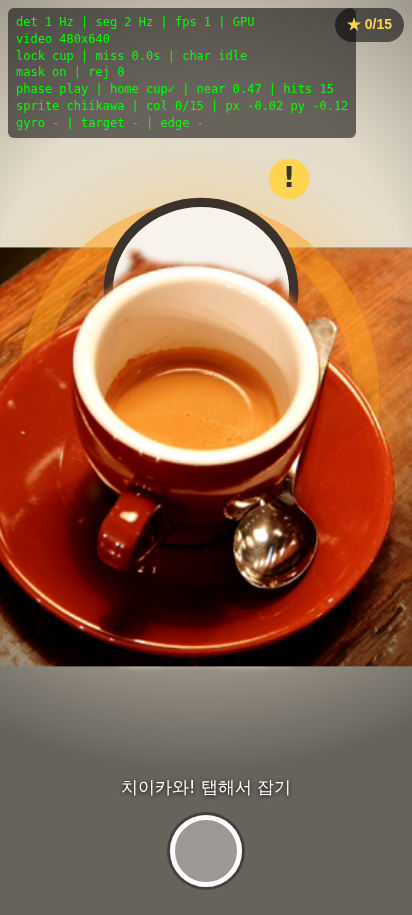 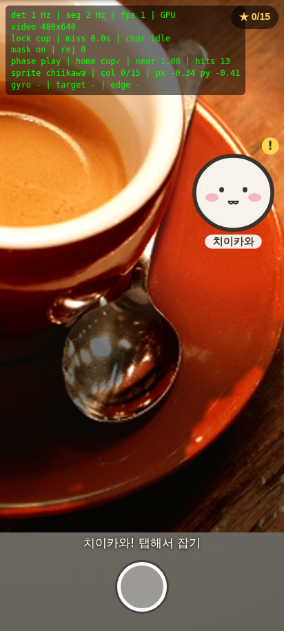
- Edge direction hint when the target is out of frame: 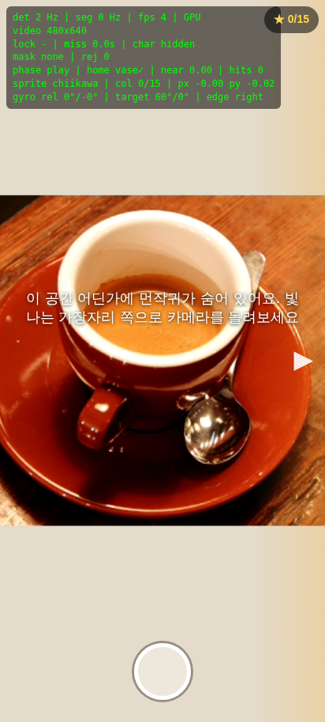 (S15; synthetic gyro, target 60° to the right).
- Glow ring on a bright background: 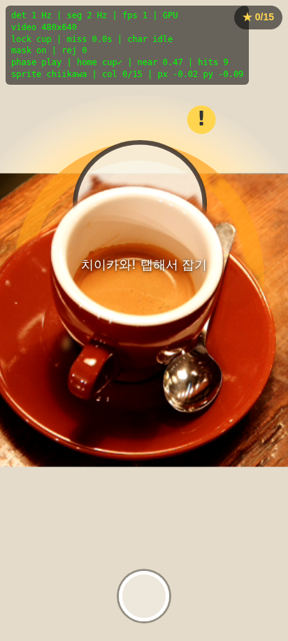 (S14; the orange rim stays visible where the radial glow washes out).
- The container renders WebGL in software (SwiftShader), so detection ran at 1–2 Hz there. **Real-device Hz must be checked on a phone.** Use `?res=480` if it is below 10 Hz.

## Character style preview (toward S6)

`docs/preview/character-lab.html` renders the soot-sprite replacement candidate — a round yellow cat motif — in five 3D styles (cel toon, jelly, clay, low-poly, voxel) with three.js, all from one shared parts definition and no image assets. Open it from GitHub Pages at `/peekaboo/docs/preview/character-lab.html`. Drag to rotate; the six body-color chips are the candy colors from `SPRITES`.

`docs/preview/squishy-lab.html` narrows that to the clay and jelly line, pushed toward the squishy-toy look: three materials (mochi, pudding jelly, clay dough) driven by two sliders, *derpiness* (flatter body, small far-apart eyes, stub arms) and *squishiness* (poke squash depth and spring damping). Tap a model to poke it.

`docs/preview/hachan-lab.html` is the current direction: three figures (peeking, sitting-teary, slumped) built from six design rules taken from 2026 character trends (head-as-body, dot eyes with eyebrows carrying emotion, deliberate asymmetry, low-saturation matte vinyl, posture, harmless emotions), with three expressions and seven body colors. The peeking figure is the pose the app will use.

`docs/preview/emoticon-lab.html` benchmarks the top KakaoTalk emoticons (Dyu Ganadi, Broken Bear, Zanmang Loopy, Nagano bear, Choonsik, Tomong the talking potato, plus the 2025 doodle-style risers) in a table and renders their shared grammar as a six-cell 3D emoticon sheet: wailing, slumped, smug, blank, lying flat, peeking. Ivory body by default, hand-drawn wobbly outline toggle, seven body colors.

`docs/preview/base-lab.html` proposes five new base characters instead of restyling the cat: a mole popping out of a mound, a seal pup lying flat, a bread loaf, a crying chick, and a small ghost. Each is built in the same emoticon grammar, scored on derpiness, trend fit and entrance, and compared in a table. Recommendation: the mole first, the seal second.

`docs/preview/asset-lab.html` is a catalog of ready-made character assets by license: Microsoft Fluent Emoji 3D (MIT; 59 candidate PNGs are vendored under `docs/preview/fluent3d/` with their LICENSE), CC0 GLB packs (Gobkit, KayKit, Quaternius, Kenney, RobotExpressive), Apache/OFL and CC-BY emoji sets, and conditional ones (Tossface, OpenMoji, Mixamo), with how each would plug into the app.

`docs/preview/motion-lab.html` animates those 59 candidates like messenger emoticons: 45 use Microsoft's official Fluent Emoji animations (MIT, re-encoded to 128px animated WebP under `docs/preview/fluent3d-anim/`), the rest get CSS motion presets (bounce, shiver, shake, nod, pop, peek, look, tears, sparkle) that map to the app's states; tap a tile to squash it.

`docs/preview/theme-lab.html` researches what makes collections compelling (Pokémon, Pokémon bread stickers, Neko Atsume, Pikmin Bloom decor, Animal Crossing, blind boxes), compares five collection themes for this app, and mocks up the recommended one: a *household-object goblin* dex where each of the 55 targetable COCO classes is one species (one base character plus 55 costumes), grouped into eight room sets with rarity tiers and a night-time variant. The mock dex is clickable.

`docs/preview/ip-lab.html` looks at the other route: licensing an existing branded roster instead of inventing one. It compares 13 IPs (Catch! Teenieping, Sanrio, Shinbi Apartment, Chiikawa, Zanmang Loopy, Broken Bear, Cookie Run, MapleStory, Squishmallows, Smiski, Pokémon, Yo-kai Watch, Pop Mart) on roster size, fit with the hide-and-appear mechanic, MZ taste, app-licensing precedent and feasibility, lists the contact routes, explains MG and running-royalty terms, and includes a proposal email draft. No IP artwork is included.

`docs/preview/chiikawa-lab.html` is the proposal package for the chosen IP, Chiikawa (먼작귀): the rights map (Nagano, Spiral Cute as licensing manager, Daewon Media as the Korean window, Applibot's Chiikawa Pocket as the app precedent), three approach routes ranked by feasibility (a Korea-only in-store web AR promotion first), a Chiikawa-style dex design, a timeline, and proposal drafts in Korean for Daewon Media and in Japanese for Spiral Cute. No IP artwork.

## Not yet verified on a phone

- Detection / segmentation Hz, heat, and mask flicker on real Android Chrome (if flicker is bad, set `MASK_EMA` in `app.js` to 0.7).
- The `navigator.share` file-sharing path (headless only exercised the download fallback).
- iOS Safari.

## Official character assets (collaboration)

The characters must be the rights holder's original artwork, not recreations. Two ways to use them:

1. **On the phone, no upload (recommended before a license is signed)**: open the ★ dex panel → **원본 그림 넣기** → pick the files (`<id>.png`, optional `<id>_wave.png`). They are stored in the browser's IndexedDB on that device only and used immediately.
2. **In the repo**: drop the files into `assets/skins/chiikawa/` and list them in `manifest.json`.

Either way the app renders those images everywhere (scene, dex panel, shared photo). Spec and manifest options: [assets/skins/chiikawa/README.md](assets/skins/chiikawa/README.md). Species without a file fall back to the canvas drawing.

## Decision records

`docs/adr/` — one ADR per decision made on a "fastest effort" basis.
