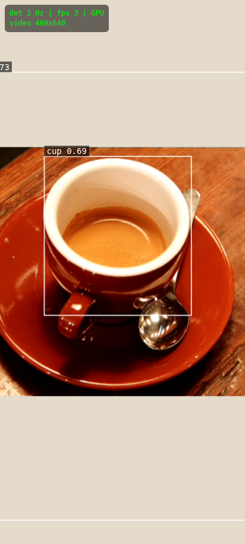
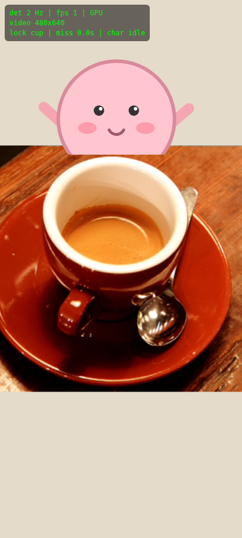
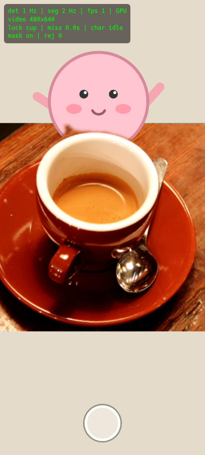

# Peekaboo AR — 물체 뒤 캐릭터

폰 카메라로 컵을 비추면 컵 **뒤에서** 2D 캐릭터가 올라오는 웹 데모.
빌드 도구 없음 — `index.html` + `app.js` 두 파일, 라이브러리는 CDN ESM, 모델은 Google 스토리지에서 직접 로드.

- 검출: MediaPipe ObjectDetector (EfficientDet-Lite0 fp16, COCO 80종)
- 오클루전: MediaPipe InteractiveSegmenter (MagicTouch) 마스크로 비디오를 클리핑해 캐릭터 위에 덮음
- 추적: 허용 클래스 중 가장 큰 검출을 락 → IoU 매칭 → One Euro 필터 스무딩

## 실행

1. GitHub Pages: Settings → Pages → Deploy from a branch, `main` / `(root)`. `https://<id>.github.io/peekaboo/` 를 안드로이드 Chrome에서 연다.
2. 로컬: `npx serve .` 후 HTTPS 터널(`cloudflared tunnel --url http://localhost:3000`)로 폰에서 연다. 카메라 권한은 HTTPS(또는 localhost)에서만 뜬다.
3. "카메라 시작" 버튼 → 컵을 화면 중앙에 비춘다 → 캐릭터가 컵 뒤에서 올라온다. 탭하면 손을 흔들고, 하단 셔터로 합성 이미지를 공유/저장한다.

### URL 쿼리

| 쿼리 | 효과 |
|---|---|
| `?res=480` | 카메라 입력을 640×480으로 낮춤 (검출 Hz < 10일 때) |
| `?mask=0` | 세그멘테이션 끄고 bbox 사각형 오클루전(S3 방식)만 사용 |
| `?debug=0` | 검출 박스·라벨 숨김 (HUD는 항상 표시) |

HUD(좌상단): 검출 Hz · 세그 Hz · 렌더 fps · 딜리게이트 · 락 클래스 · miss 시간 · 캐릭터 상태 · 마스크 상태.

## 단계 (코드의 `S1`~`S5` 주석과 커밋 이력)

| 단계 | 내용 | 커밋 |
|---|---|---|
| S1 | 카메라 + ObjectDetector 루프 + HUD | `S1: camera + object detection` |
| S2 | 타깃 락 + IoU 매칭 + One Euro 필터 | `S2: target lock + one euro filter` |
| S3 | 2D 캐릭터 peek/idle/hide + bbox 사각 오클루전 | `S3: character peek with bbox occlusion` |
| S4 | InteractiveSegmenter 마스크 오클루전 (EMA·블러·IoU 게이트) | `S4: segmentation mask occlusion` |
| S5 | 탭 → wave, 셔터 → Web Share/다운로드, 안내 문구 | `S5: tap reaction + share` |
| S6 | (선택) three.js GLB 캐릭터, iOS 확인 — **미구현**, [ADR-0007](docs/adr/0007-skip-s6-glb-and-ios.md) | — |

## 검증 (헤드리스 Chromium + 가짜 카메라)

실기기 없이 Playwright로 실제 구동해 확인했다 ([ADR-0004](docs/adr/0004-verify-with-fake-camera.md)). 가짜 카메라 프레임은 scikit-image 샘플 `coffee.png`(실제 커피잔 사진).

| S1 검출 | S3 사각 오클루전 | S4 마스크 오클루전 | S5 셔터 |
|---|---|---|---|
|  |  |  |  |

- `cup` 0.69로 검출·락, 캐릭터 peek → idle, 마스크로 컵 윗부분 곡면대로 가려짐, 탭 → `wave`, 셔터 → `peekaboo-<ts>.jpg` 다운로드 확인.
- 컨테이너는 소프트웨어 GL(SwiftShader)이라 검출 1~2Hz. **실기기 Hz는 폰에서 확인해야 한다.** 10Hz 미만이면 `?res=480`.

## 아직 폰에서 확인 안 된 것

- 안드로이드 Chrome 실기기 검출/세그 Hz, 발열, 마스크 깜빡임(심하면 `app.js`의 `MASK_EMA`를 0.7로).
- `navigator.share` 파일 공유 경로 (헤드리스는 다운로드 폴백으로 확인).
- iOS Safari.

## 의사결정 기록

`docs/adr/` — 최단 공수 기준으로 내린 결정만 ADR 한 건씩.
